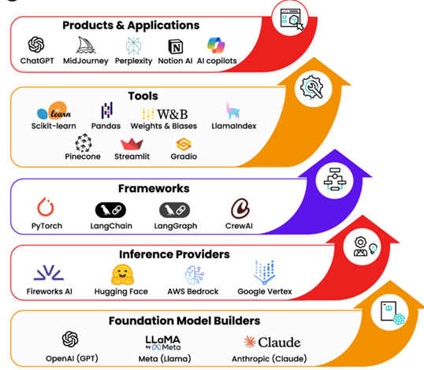

foundation models vs large language models

## Foundation Models - 
The base layer of the stack. 

These are the massive models trained by labs like OpenAI (GPT), Meta (Llama), and Anthropic (Claude). 

They’re the engines that power the rest of the ecosystem.

## Inference & Platforms -
Once models exist, they need to be served efficiently. 
Inference providers like Fireworks AI, Hugging Face, AWS Bedrock, and Google Vertex AI make this possible. 

Some platforms go further, supporting fine-tuning, deployment, and monitoring, blending infrastructure with orchestration.

## Frameworks - 
The developer toolkit layer. 

Frameworks like PyTorch and TensorFlow (for ML) or LangChain, LangGraph, and CrewAI (for GenAI and agents) help developers turn raw model capabilities into usable systems.

## Tools & Integrations - 
The practical layer for builders. 
Libraries like Scikit-learn, Pandas, and Weights & Biases for classic ML and experiment tracking. 

LlamaIndex and vector databases (Pinecone, Weaviate) give LLMs memory. 

Streamlit and Gradio help you build quick interactive demos.

## Applications & Products - 
The top layer, where end-users interact. 
From ChatGPT, Perplexity, and MidJourney to AI copilots inside Microsoft Office or customer support assistants, this is the visible layer powered by all the ones below.

## Horizontal vs Vertical AI - 
Some apps are general-purpose (like ChatGPT or Notion AI), while others are domain-specific, built for healthcare, law, retail, or finance,

solving specialized problems deeply.

## RAG

RAG (Retrieval-Augmented Generation) excels at grounding an AI's knowledge with static,

document-based information, like a company's internal documents

RAG answers questions using retrieved text.

The two are not mutually exclusive and are often combined in a hybrid approach, 

with MCP providing tool access and RAG providing the initial knowledge retrieval to inform the LLM's actions

## MCP (Model Context Protocol) 

MCP allows an AI to access live data and interact with external systems and APIs

MCP enables AI to do things, like creating tickets or updating records.

====

RAG tells your model what to say, MCP controls how it says it.

RAG expands what model knows, MCP controls how that knowledge is organized and delivered.

