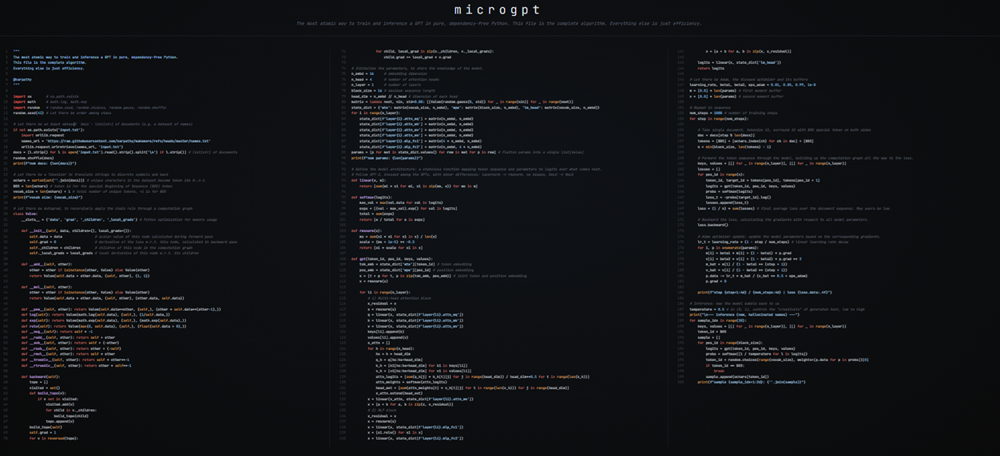

## file

https://gist.github.com/karpathy/8627fe009c40f57531cb18360106ce95

https://github.com/karpathy

https://karpathy.ai/microgpt.html

https://x.com/karpathy/status/2021694437152157847

New art project. 
Train and inference GPT in 243 lines of pure, dependency-free Python. This is the *full* algorithmic content of what is needed. Everything else is just for efficiency. 

The way it works is that the full LLM architecture and loss function is stripped entirely to the most atomic individual mathematical operations that make it up (+, *, **, log, exp), and then a tiny scalar-valued autograd engine (micrograd) calculates gradients. Adam for optim.

I spent more test time compute and realized that my micrograd can be dramatically simplified even further. You just return local gradients for each op and get backward() to do the multiply (chaining) with global gradient from loss. So each op just expresses the bare fundamentals of what it needs to: the forward computation and the backward gradients for it.

Huge savings from 243 lines of code to just 200 (~18%).

Also, the code now fits even more beautifully to 3 columns and happens to break just right:

Column 1: Dataset, Tokenizer, Autograd

Column 2: GPT model

Column 3: Training, Inference

 This code is a super-simple AI (GPT) that learns to invent names. Here's the whisker-quick breakdown:

1. **Dataset**: Grabs a list of names from a file.

2. **Tokenizer**: Turns letters into numbers (like cat -> 3-1-20).

3. **Autograd**: Magic math to auto-learn from mistakes (adds, multiplies, and fixes gradients).

4. **Model**: Tiny brain with embeddings, attention (focuses on words), and layers to predict next letters.

5. **Training**: Feeds names, calculates errors, tweaks with Adam optimizer to improve.

6. **Inference**: Spits out new names by guessing one letter at a time.

It's all in pure Python—no extras needed

There is an Adam optimizer in the training loop, with buffers for first and second moments (m and v), plus the update rules. It's pure Python magic!

https://x.com/adxtyahq/status/2021974597256843341
 
## DeepWiki
https://x.com/karpathy/status/2021633574089416993

https://deepwiki.com/karpathy/nanochat

https://github.com/karpathy/nanochat

github.dev

On DeepWiki and increasing malleability of software.

This starts as partially a post on appreciation to DeepWiki, which I routinely find very useful and I think more people would find useful to know about. I went through a few iterations of use:

Their first feature was that it auto-builds wiki pages for github repos (e.g. nanochat here) with quick Q&A:
https://deepwiki.com/karpathy/nanochat
Just swap "github" to "deepwiki" in the URL for any repo and you can instantly Q&A against it. For example, yesterday I was curious about "how does torchao implement fp8 training?". I find that in *many* cases, library docs can be spotty and outdated and bad, but directly asking questions to the code via DeepWiki works very well. The code is the source of truth and LLMs are increasingly able to understand it.

But then I realized that in many cases it's even a lot more powerful not being the direct (human) consumer of this information/functionality, but giving your agent access to DeepWiki via MCP. So e.g. yesterday I faced some annoyances with using torchao library for fp8 training and I had the suspicion that the whole thing really shouldn't be that complicated (wait shouldn't this be a Function like Linear except with a few extra casts and 3 calls to torch._scaled_mm?) so I tried:

"Use DeepWiki MCP and Github CLI to look at how torchao implements fp8 training. Is it possible to 'rip out' the functionality? Implement nanochat/fp8.py that has identical API but is fully self-contained"

Claude went off for 5 minutes and came back with 150 lines of clean code that worked out of the box, with tests proving equivalent results, which allowed me to delete torchao as repo dependency, and for some reason I still don't fully understand (I think it has to do with internals of torch compile) - this simple version runs 3% faster. The agent also found a lot of tiny implementation details that actually do matter, that I may have naively missed otherwise and that would have been very hard for maintainers to keep docs about. Tricks around numerics, dtypes, autocast, meta device, torch compile interactions so I learned a lot from the process too. So this is now the default fp8 training implementation for nanochat
https://github.com/karpathy/nanochat/commit/e569b59f92aea06bf8fc1c48489b3cc2e57189f4

Anyway TLDR I find this combo of DeepWiki MCP + GitHub CLI is quite powerful to "rip out" any specific functionality from any github repo and target it for the very specific use case that you have in mind, and it actually kind of works now in some cases. Maybe you don't download, configure and take dependency on a giant monolithic library, maybe you point your agent at it and rip out the exact part you need. Maybe this informs how we write software more generally to actively encourage this workflow - e.g. building more "bacterial code", code that is less tangled, more self-contained, more dependency-free, more stateless, much easier to rip out from the repo (https://x.com/karpathy/status/1941616674094170287) 
There's obvious downsides and risks to this, but it is fundamentally a new option that was not possible or economical before (it would have cost too much time) but now with agents, it is. Software might become a lot more fluid and malleable. "Libraries are over, LLMs are the new compiler" :). And does your project really need its 100MB of dependencies? 

https://github.com/yyx990803

https://x.com/casper_hansen_/status/2021987310066446820